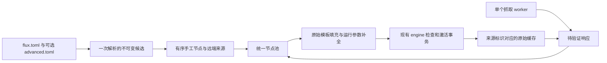

# 架构

> **投影。** 给实现者的一页定向图：系统为什么长这个样子，而不是怎么操作它。合同是 [`../spec/blueprint.md`](../spec/blueprint.md)；本文与它冲突时，错的是本文。

蓝图只有一份，没有增量层。曾经叠在基线上的两份增量已折入正文，原件冻结在 [`../history/`](../history/)；每个退役的 `R09x` 编号现在由哪一节承载，见蓝图开头的对照表（`../authoring.md` AUTH-7.2）。

## 形状

```text
┌──────────────────────────────────────────────────────────────┐
│ 被选中的 app                                                  │
└───────────────────────────┬──────────────────────────────────┘
                            │ connect() / sendmsg()
┌───────────────────────────▼──────────────────────────────────┐
│ 物理接口，TC egress，chain 0，逐接口动态选 pref                 │
│   flx_cap_l2  (ARPHRD_ETHER)                                  │
│   flx_cap_l3  (ARPHRD_RAWIP、CLAT tun) + skb_change_head(14)   │
│                                                               │
│   不是我们的 ───────────────────────► TC_ACT_UNSPEC（直连）     │
│   已入场 ───────────────────────────► bpf_redirect(flxrs0)     │
│   入场后失败 ───────────────────────► TC_ACT_SHOT              │
└───────────────────────────┬──────────────────────────────────┘
                            │ veth_xmit
┌───────────────────────────▼──────────────────────────────────┐
│ flxrs1，TC ingress：flx_in                                     │
│   bpf_skb_change_type(PACKET_HOST)                             │
│   TCP SYN  ─► 查 listener ─► bpf_sk_assign ─► TC_ACT_OK         │
│   TCP 其余 ──────────────────────────────────► TC_ACT_OK        │
│   UDP      ─► 查 listener ─► bpf_sk_assign ─► TC_ACT_OK         │
└───────────────────────────┬──────────────────────────────────┘
                            │ ip rule pref 100 iif flxrs1 → table 20260
                            │ local default dev lo
┌───────────────────────────▼──────────────────────────────────┐
│ sing-box tproxy inbound（官方二进制，IP_TRANSPARENT）           │
└──────────────────────────────────────────────────────────────┘
```

## 为什么是这个形状

两条事实——都来自第一手源码和真机实测——排除了所有替代方案：

1. **UDP 的原始目的地址在 cgroup hook 里拿不回来。** `IP_RECVORIGDSTADDR` 这个 cmsg 是内核在 `udp*_recvmsg` 里读包自己的 IP 头产生的；`BPF_CGROUP_UDP4_RECVMSG` 程序只能改写交还给用户态的 sockaddr。所以任何"既保留真实目的地址、又不改引擎"的设计，都必须让真实的包头到达 listener。
2. **一次性的 cgroup 快照建立不了安全的所有权边界。** Phase 0 的干净快照里 root cgroup 没有任何 `SOCK_ADDR` attach，尽管 AOSP 的程序已经加载；Android 可以动态 attach 它们，而一个 `flags=0` 的祖先会阻止后代共存。所以 Flux 从不 attach cgroup BPF，也不去争那些槽位。

`bpf_sk_assign()` 同时满足两条：它把一个 socket 关联到 skb，让内核本地投递，一个 L3/L4 字节都不碰。

## crate

| crate | 内容 | 约束 |
|---|---|---|
| `flux-core` | 配置、selector、CIDR、ABI 镜像、wire 类型、版本算术、节点解析/组装、订阅精修、SSID 判定、§26 Planner | 无 `libc`、无系统调用、`unsafe` 禁止。测试在任何主机上跑 |
| `fluxd` | reactor、netlink、BPF 加载器、网络对象、引擎监督、监督进程 | 唯一碰内核的 crate |
| `xtask` | 构建、打包、发布、文档机检 | 只在开发主机上跑，不发布 |

`fluxd → flux-core`，`xtask → flux-core`，永不反向。没有 platform、testkit、backend-registry 这类 crate，也没有为单一实现准备的 trait 抽象层。

两条内部边界是承重的，继承自旧仓库的过度设计审查：原始 netlink 报文的构造只在 `fluxd/src/netlink/`，原始 `bpf(2)` 只在 `fluxd/src/bpf/`。调用方看到的是 `create_veth`、`add_rule`、`attach_filter`、`publish_control`，从来不是 `nlmsghdr`。

模块接口与状态归属见蓝图 §10.2；不为单一实现引入公开 trait。加载器自己执行内核前置检查，所以 `fluxd check`、守护进程和设备测试走同一条规则。时间格式化由日志和诊断共用的 `time` 模块提供，诊断代码不再反向依赖 reactor。

## 节点来源共享一条生成路径



来源类型在解析边界决定，不靠抓取失败后猜格式。HTTP 订阅和 HTTP 手工代理有明确写法；本地节点文件只贡献手工节点。清洗与分组正则随候选编译，手工名保留。来源顺序和身份属于纯逻辑层。

`configuration` 是运行、诊断和安装共用的配置读取边界。`subscription` 管理有界的单个抓取批次和候选快照；reactor 只协调一次引擎事务。缓存以准确 URL 的 SHA-256 命名，移除正文与 URL 标记的双文件一致性问题。只有接受后的原始响应才持久化，没有缓存索引或精修缓存。

`logger` 自己持有文件、字节计数和保留策略，在写入时轮转。`layout` 统一私有路径和原子替换。安装器持有 daemon 的同一把锁，使用 `flux-core::migration` 准备两个 TOML 文档，验证和备份后先写进阶文件，再写主文件；运行循环不承担迁移工作。

`run/` 跨重启保留，集中机器产物。sing-box 的工作目录仍是数据根；只为未明确指定的已启用缓存补全绝对路径，避免改变用户原有相对路径的意义。

## 两个进程

`service.sh` 只启动一个进程就退场。那个进程是**监督进程**：它把自己的二进制（`/proc/self/exe`）重新执行一遍作为 **reactor**，然后只做两件事——等它退出、转发信号。reactor 才是蓝图其余部分描述的那个守护进程：持 `run/daemon.lock`、开控制 socket、拥有全部内核对象、跑状态机。reactor 崩了，监督进程按 1/2/4/8/30 s 退避重启它；reactor 以 0 退出（`fluxd stop`），监督进程跟着退出；reactor 以 3 退出（锁已被别的实例持有），监督进程不重启。杀掉监督进程不影响代理——reactor 拥有一切，它就是那个实例（§13.2.2）。

## 失败语义

整个系统最重要的一条规则：

| 时机 | 失败时 |
|---|---|
| TCP socket 还没有 CAPTURED 决定，或当前 UDP 报文还没重定向 | `TC_ACT_UNSPEC`——这条流 / 这个报文直连 |
| socket 已有 CAPTURED 决定 | `TC_ACT_SHOT`——丢包 |

没有第三个选项。入场之后回落到真实目的地址会泄漏用户要求代理的流量，所以处处禁止，包括快照损坏和 generation 不匹配的情形。

用 `TC_ACT_UNSPEC` 而不是 `TC_ACT_OK` 是有讲究的：`TC_ACT_OK` 会结束分类器链，跳过 AOSP 的 CLAT 和 OEM 的 filter，而直连流量还需要它们。

## 状态

reactor 是单线程 epoll，没有周期性轮询。事件源：rtnetlink、inotify、pidfd、signalfd、BPF fault ringbuf、控制 socket、timerfd、订阅工作线程的 eventfd，以及 `[ssid]` 非空时的 nl80211 generic netlink（§10.4）。

三个顶层状态：`Disabled`、`Inactive`、`Active`。进入 `Active` 的唯一途径是在引擎就绪、且至少一个物理捕获接口完成存活验证之后，做一次 `control_root` map-in-map 的指针切换；离开它的第一个动作永远是发布 `active = 0`。连着 `[ssid]` 列出的 Wi-Fi 时，Flux 走的就是开关关掉时那一次转移——停引擎、留对象、等事件——只是状态报 `Inactive` 并说明原因（§29.5）。

一个容易搞错、搞错代价很大的区分：**捕获侧漂移是日常，核心漂移不是。** netd 在接口离开网络时会删掉物理接口的 `clsact` qdisc，我们的 filter 随之消失。Flux 只把那个接口从覆盖里拿掉，等 netd 重建 `clsact`，然后重跑逐接口 admission。别的捕获接口还在时，全局 `active` 不动；最后一个活跃接口消失时才发布 inactive，就绪的引擎可以留着等。Flux 从不创建物理接口的 `clsact`。把每一次单接口漂移都升级成全局事务，会让每次 Wi-Fi 重连都让无关的代理流闪断一下。见 `../spec/blueprint.md` §8.5.1，以及 §8.5、§10.1。

**定时计划也有唯一来源。** 用户配置派生出订阅刷新计划，timer 直接执行这份计划；抓取失败不取消计划，重设间隔不回读旧策略。路由恢复可额外触发一次抓取，但路由状态不等于校园认证或互联网可达性。`Active` 只描述本地机制就绪；网络策略与可达性证据见 [`network-policy.md`](network-policy.md)。
